# MØSBurger-Frontend
# 1.簡介
這是模擬電商平台常見功能的全端專案，包含商品展示、帳戶驗證、會員管理和線上購物。支援信用卡和會員卡兩種支付方式，並搭配完善的資料流程提供用戶最好的體驗。

本篇將以介紹前端功能與架構為主

# 2.系統功能
本系統有四大核心功能：商品展示、帳戶驗證、會員管理、線上購物。

### 商品展示
- **展示功能**：顯示各商品的詳細資訊
- **排序功能**：商品可依照價格和卡路里排序
- **搜尋功能**：根據關鍵字搜尋商品
- **下單功能**：登入成功後可將商品加入購物車

### 帳戶驗證
- **註冊功能**：建立專屬帳號
- **登入功能**：登入後可使用會員功能
- **忘記密碼**：寄送 email 驗證信重設密碼

### 會員管理
- **會員資訊**：顯示使用者名稱、會員卡面和會員卡餘額
- **儲值功能**：經由第三方金流（Stripe）儲值會員卡
- **交易明細**：記錄會員卡交易紀錄
- **歷史訂單**：記錄曾購買的商品詳情
- **更改密碼**：可更改密碼，並於下次登入生效
- **編輯會員資訊**：可修改使用者名稱和會員卡面

### 線上購物
- **購物車**：記錄預計購買的商品，同時也可以修改商品數量
- **結帳**：可填寫備註並選擇以會員卡或信用卡付款

# 3.技術
**程式語言**：TypeScript

**前端技術**：React、TailwindCSS、shadcn/ui

**後端技術**：Node.js(Express)

**資料庫與ORM**：MongoDB(Mongoose)、PostgreSQL(Prisma)

**開發工具與環境**：Git、VS Code、Docker、WSL

**第三方服務**：Gmail API、Stripe、Cloudinary

**驗證與安全**：JWT、express-validator、Zod

# 4.系統流程
## 4.1 狀態管理
  本系統會根據JWT Token判斷登入狀態，登入狀態會影響頁面的功能和訪問權限，本小節將介紹與登入狀態有密切關係功能和頁面:
  ### A. 導覽列
  

    
  

  圖4.1：導覽列登入前後比較圖

  本系統導覽列採用響應式設計，依據裝置尺寸調整顯示方式。圖4.1為本系統在行動端的顯示範例，左圖為未登入的導覽列；右圖為登入後的導覽列。系統會在未登入狀態提供會員登入功能，在登入狀態提供登出功能。

  ### B. 商品卡片
  

    
  

  圖4.2：商品卡片登入前後比較圖

  如圖4.2所示，左圖為登入前的商品卡片，提供商品名稱、商品圖片和價錢；右圖為登入後的商品卡片，額外提供線上購物功能，包含數量調整器與「加入購物車」按鈕，讓使用者可直接操作以進行選購。

  ### C. 頁面
  登入頁面是啟用會員功能的關鍵，當使用者登入成功，才能開始使用各項會員服務。系統也會依據登入狀態，導向至對應的頁面，防止未登入者未經授權使用會員功能。

  #### 帳戶驗證

  

  表4.1：帳戶驗證頁面訪問權限比較表

  帳戶驗證模組有登入功能、註冊功能和忘記密碼功能，對應頁面如下:
  - **登入功能**：登入頁面(/auth/login)
  - **註冊功能**：註冊頁面(/auth/signup)
  - **忘記密碼功能**：忘記密碼頁面和重設密碼頁面(/auth/forgetpassword、/auth/resetpassword)

  如表4.1所示，未登入狀態下可直接訪問上述所有頁面；然而在已登入狀態則沒有授權，系統會直接導向首頁。

  #### 會員管理

  

  表4.2：會員管理頁面訪問權限比較表

  會員管理模組有會員主頁功能、歷史訂單功能、交易紀錄功能、修改密碼功能和編輯會員資訊功能，對應頁面如下:

  - **會員主頁功能**：會員主頁頁面(/member/main)
  - **歷史訂單功能**：歷史訂單頁面(/member/purchase)
  - **交易紀錄功能**：交易紀錄頁面(/member/transaction)
  - **修改密碼功能**：修改密碼頁面(/member/updatepassword)
  - **編輯會員資訊功能**：編輯會員資訊頁面(/member/updateuserinfo)

  如表4.2所示，當使用者未登入時，若訪問上述任一頁面，系統將強制導向登入頁面；登入成功後，則會自動導回原先欲訪問的頁面。

  #### 線上購物

  

  表4.3：線上購物頁面訪問權限比較表

  線上購物模組有購物車功能和結帳功能，對應頁面如下:

  - **購物車功能**：購物車頁面(/cart/main)
  - **結帳功能**：結帳頁面(/cart/checkout)

  如表4.3所示，當使用者未登入時，若訪問上述任一頁面，系統將強制導向登入頁面；登入成功後，系統只會導向美食專區(主餐頁面)。
## 4.2 忘記密碼

  

  圖4.3：忘記密碼流程圖

  會員忘記密碼造成無法登入，可使用忘記密碼功能重新設定密碼。如圖4.3所示，忘記密碼功能分為兩個階段:
  
  **忘記密碼**：在忘記密碼頁面信箱輸入信箱後，系統會透過GMail傳送重設密碼之郵件至輸入信箱，同時將忘記密碼頁面導向首頁。

  **重設密碼**：當訪問重設密碼頁面，系統會檢查連結是否有效，若有效可以重新設定新密碼，之後重設密碼頁面便會導向登入頁面。

## 4.3 會員卡儲值

  

圖4.3：會員儲值卡流程圖

會員卡可用於支付消費金額，其儲值方式為信用卡。本系統使用Stripe為金流。

如圖4.3所示，在會員卡頁面確認儲值金額後，頁面會從會員主頁頁面導向Stripe的支付畫面，同時於交易紀錄頁面建立一筆待付款的交易。當付款成功，頁面會從Stripe的支付畫面導向交易紀錄頁面並顯示付款成功。當離開Stripe的支付畫面，頁面會導回至會員主頁頁面。如果在付款期限至交易頁面，可看到待付款的交易和付款連結，反之如果超過付款期限則會顯示交易失敗。

## 4.4 線上購物

  

圖4.4：線上購物流程圖

如圖4.4所示，會員可在美食專區頁面將要買的商品加入購物車，在確認訂單之前，可在購物車頁面修改商品數量。當會員確定要購買時可前往付款頁面填寫備註和付款方式，此外在購物車頁面導向付款頁面過程，本系統有設置商品數量條件，避免會員在購物車缺少商品項目做出未授權行為。

本系統支援信用卡和會員卡兩種付款方式：

信用卡：頁面會從付款頁面導向Stripe付款頁面，如果付款成功則會導向歷史訂單頁面，並顯示該筆訂單付款成功。如果離開付款頁面，則會返回至付款頁面。

會員卡：本系統有限制如果會員卡餘額無法支付消費金額，不能選擇會員卡付款。當使用會員卡付款後，頁面會直接導向歷史訂單頁面，並顯示該筆訂單付款成功。

# 5.系統頁面
## 5.1 首頁

  

圖 5.1：首頁

本系統的主頁面，公告會隨時間進行替換。

## 5.2 美食專區

  

圖 5.2：美食專區主餐頁面

  

圖 5.3：美食專區附餐頁面

  

圖 5.4：美食專區飲品頁面

本系統將商品分為主餐頁面、附餐頁面和飲品頁面。

  

圖 5.5: 搜尋排序功能示意圖

提供關鍵字搜尋還有排序功能，圖5.5為搜尋"烤雞"關鍵字和價錢降冪排序。

  

圖 5.6: 商品細節頁面

當點擊商品卡片，可以了解更多商品詳情，圖5.6為蜜汁起司烤雞堡的商品詳情。

## 5.3 帳戶驗證 

  

圖 5.7: 登入頁面

會員在登入頁面輸入正確的信箱和密碼才能使用會員服務，此外也有提供註冊和忘記密碼的功能(圖5.7)。

  

圖 5.8: 註冊頁面

如圖5.8所示，系統有設置表單驗證功能，幫助使用者順利註冊會員。

  

圖 5.9:忘記密碼頁面

會員不小心忘記密碼，可透過電子信箱驗證重設密碼。如圖5.9所示，當輸入電子郵件後，系統會提示信件已寄出。

  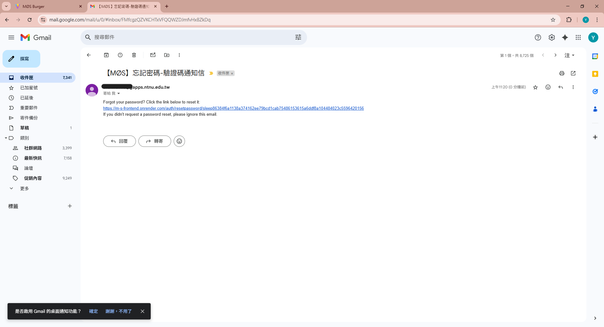

圖 5.10:收信示意圖

打開信箱可看到收到驗證信，當使用者點擊信件的連結(圖5.10)可導向至重設密碼頁面。

  

圖 5.11:重設密碼頁面

如圖5.11所示，當重設密碼成功，系統會提示重設成功。之後，會員就可以使用新密碼進行登入。

  

圖 5.12:重設密碼逾時頁面

但是如果會員沒在限制時間內完成重設密碼的操作，或是重設成功後又訪問該連結，系統會顯示操作逾時(圖5.12)。

## 5.4 會員管理

  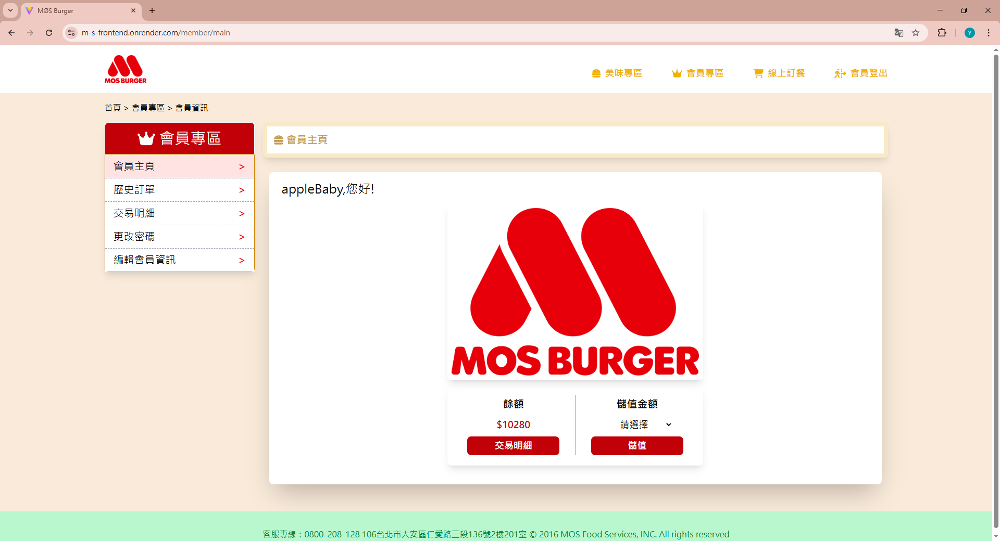

圖 5.13：會員主頁頁面

登入成功後，即可開始使用會員服務。如圖5.13所示，會員主頁有一張會員卡，會員卡下方可查看餘額、前往交易明細頁面和儲值會員卡。

  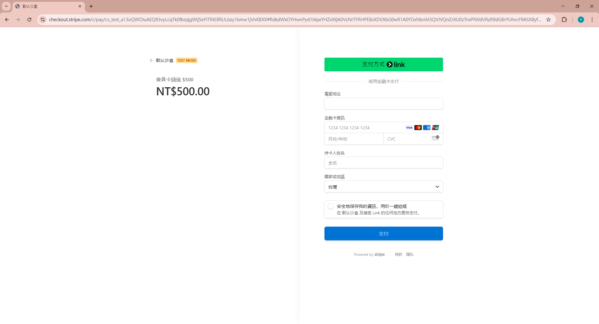

圖 5.14：Stripe付款頁面

會員確認儲值金額後便會導向Stripe付款頁面，如果會員這時候離開Stripe付款頁面，系統會提示儲值取消返回會員主頁頁面。

  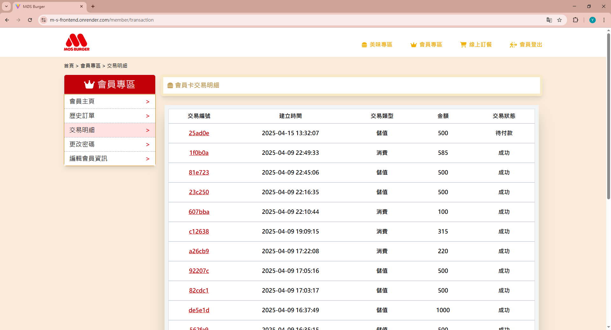

圖 5.15：交易明細頁面

如圖5.15所示，交易紀錄頁面會記錄所有關於會員卡的交易，這時候前往交易紀錄頁面可以看到有一筆待付款記錄(交易編號25ad0e)，正是先前未付款的儲值交易。

  

圖5.16：交易明細詳情待付款範例

在交易紀錄頁面(圖5.15)點擊交易編號25ad0e後可進一步查看該筆交易詳情(圖5.16)，然後點擊付款連結就可以進入到Stripe付款頁面(圖5.14)

  

圖5.17：交易明細詳情成功範例

在Stripe付款頁面(圖5.14)成功後，會導向交易明細詳情頁面，並顯示成功(圖5.17)!

  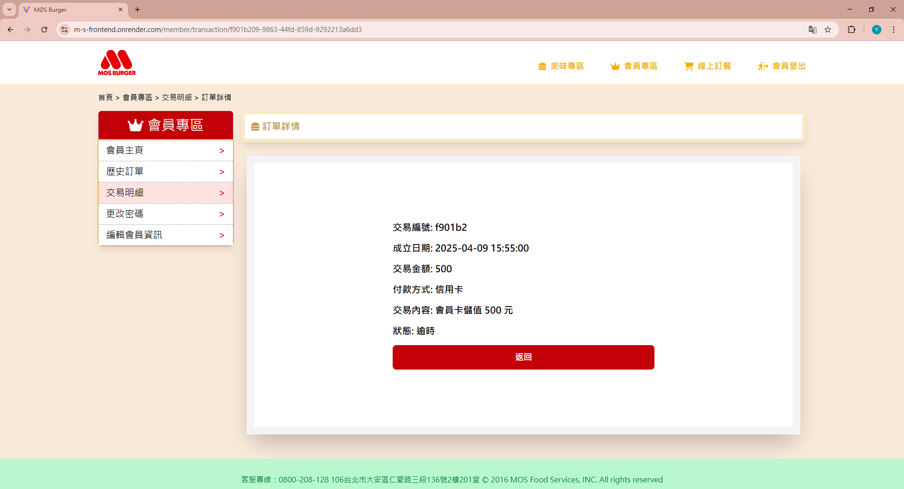

圖5.18：交易記錄狀態失敗範例

然而，如果會員沒在Stripe付款連結時效內付款，則會顯示在該筆交易顯示狀態失敗。

  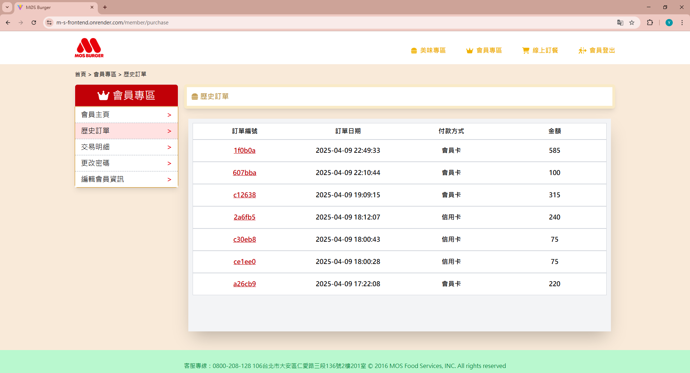

圖5.19：歷史訂單頁面

  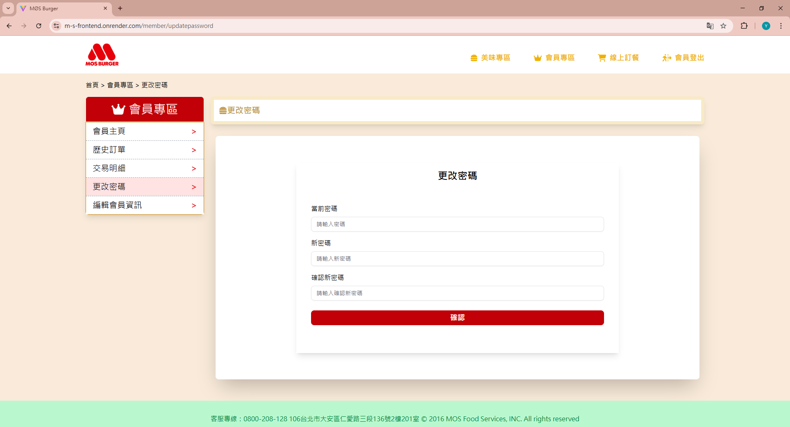

圖5.20：更新密碼頁面

  

圖5.21：更新會頁資訊頁面

在會員管理模組，除儲值功能，也還提供查看歷史訂單(圖5.19)、更新密碼(圖5.20)和更新會員資訊(圖5.21)。

## 5.5 線上購物

  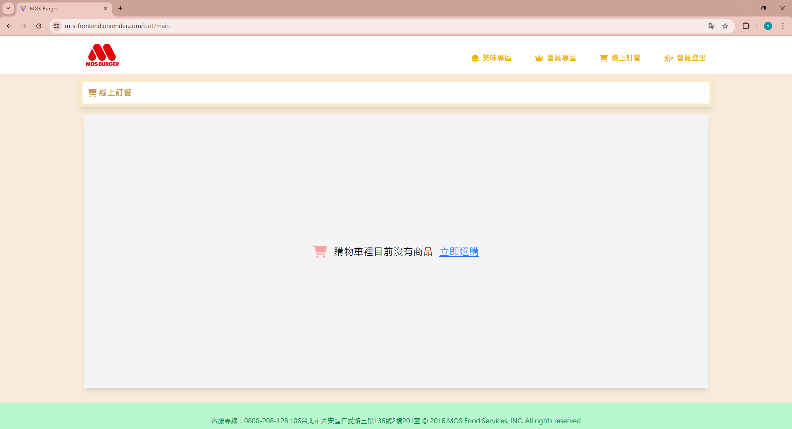

圖5.22：購物車頁面(無商品項目)

點擊線上購物會導向購物車，如果購物車沒有任何商品項目，則會提醒會員去購物(圖5.22)。

  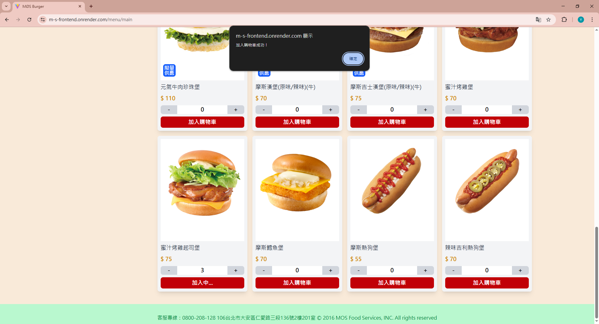

圖5.23：商品加入購物車示意圖

在登入後，美食專區的商品卡片會出現加入購物車的按鈕。如圖5.23所示，會員可以選擇要購買的商品數量加入購物車，當商品成功加入購物車後，系統也會提醒會員該商品已經加入購物車。

  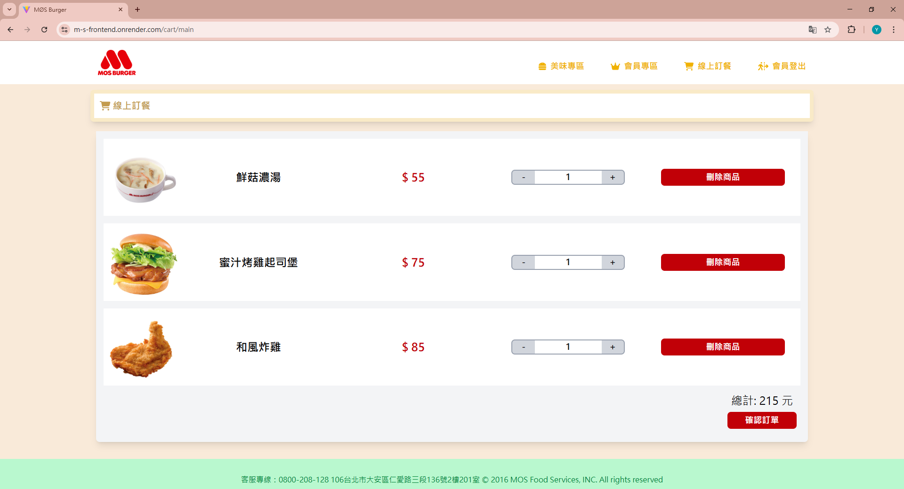

圖5.24：購物車頁面(有商品項目)

會員可以進入購物車頁面確認欲購買的商品，同時也可以調整商品數量(圖5.24)。

  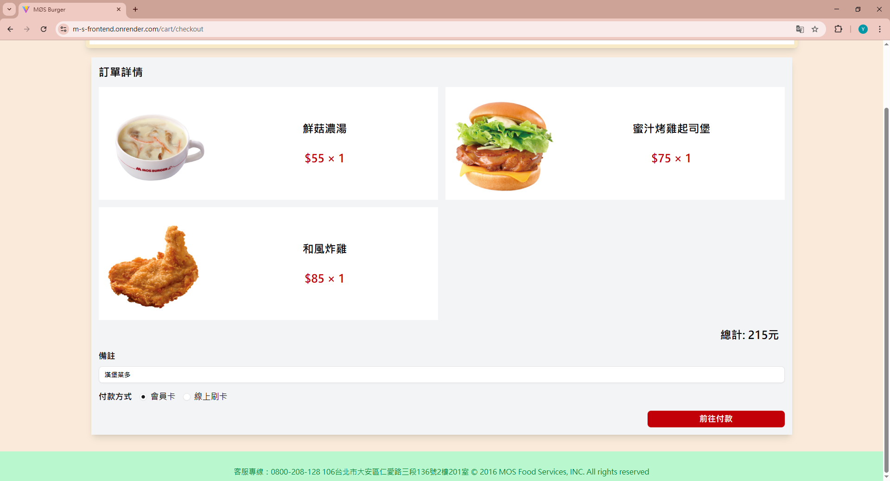

圖5.25：付款頁面

會員確認要購買的商品，可進入付款頁面填寫商品備註和選擇付款方式。

  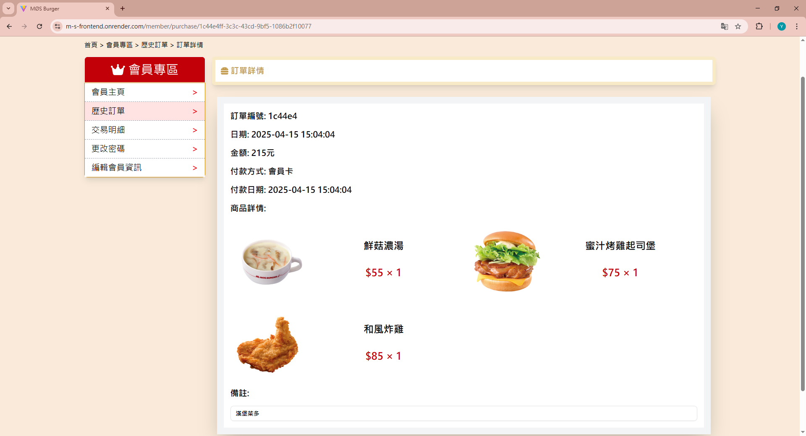

圖5.26：購買成功範例

當會員付款成功後，會導向會員專區的歷史訂單，並記錄該次的購物內容(圖5.26)。